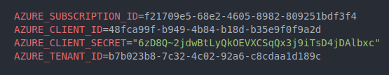
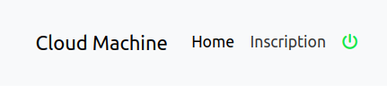
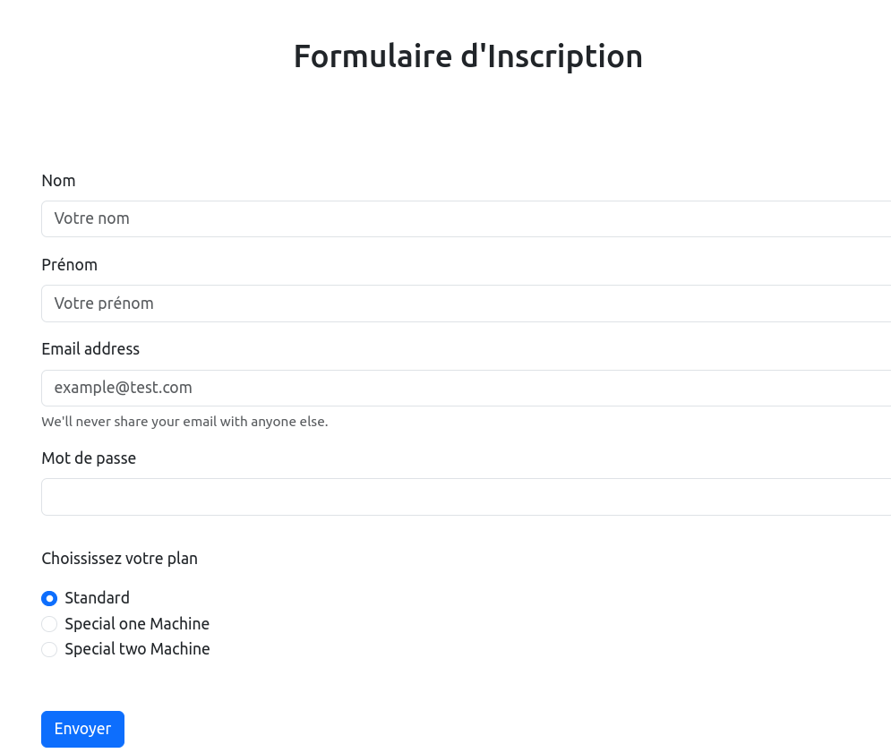

# Guide d'Installation de l'Application Cloud Machine

## Description

L'application Cloud Machine est une plateforme web pour gérer des machines virtuelles dans le cloud. Elle comprend un backend développé avec Node.js et Express, ainsi qu'un frontend réalisé avec bootstrap et jquery.

## Installation

1. **Backend :**

   - Assurez-vous d'avoir Node.js installé et d'avoir au minimum la version v21.2.0.
   - Toutes les dépendances sont déjà installé étant donner que node_modules est fournit avec dans `front_cloud` toute fois si jamais vous rencontré un problème executer la commandes suivante :

     ```bash
     cd back_api
     npm i
     ```
   - Configurez les variables d'environnement dans le fichier `.env` du dossier `back_api` avec vos propre clé et identifiants.

   - 

   - Lancez le serveur backend avec nodemon :

     ```bash
     cd back_api
     nodemon app.js
     ```

   Le serveur écoute par défaut sur le port 4000. Si vous le changer il faudra penser à le changer sur tout les call api effectuer dans les fichiers situé dans le dossier front_cloud 

2. **Frontend :**

   - Assurez-vous d'avoir Node.js installé et d'avoir au minimum la version v21.2.0.
   - Toutes les dépendances sont déjà installé étant donner que node_modules est fournit avec dans `front_cloud` toute fois si jamais vous rencontré un problème executer la commandes suivante :

     ```bash
     cd front_cloud
     npm i
     ```

   - Lancez l'application frontend avec nodemon :

     ```bash
     nodemon app.js
     ```

   L'application est accessible sur `http://localhost:3000`.
   Vous pouvez changer le port si vous le souhaiter ici aucun impact pour le lancerment de l'application.

## Utilisation

- Connectez-vous à l'adresse `http://localhost:3000`.
- Utilisez l'un des comptes suivants pour tester l'application :
  - Mail : user_1_no_credit@test.com / Mot de passe : test
  - Mail : user_2_with_credit@test.com / Mot de passe : test
  - Mail : user_3_one_machine@test.com / Mot de passe : test
- Cliquer sur le bouton vert (POWER ON):

    - 

- Saisir les coordonnées citez plus haut 

- Créez un nouveau compte utilisateur si vous le souhaiter.
    - Cliquer sur Inscription : 
        - 
    - Remplissez le formulaire suivant et cliquer sur `Envoyer`

        - 


## Sécurité des Routes

Les routes de l'application sont sécurisées à l'aide de jetons d'authentification. Chaque jeton a une durée de validité de 1 heure, après quoi l'utilisateur doit se reconnecter pour obtenir un nouveau jeton.

De plus, les mots de passe des utilisateurs sont stockés de manière sécurisée en utilisant le hachage avec bcrypt. Cela garantit que les mots de passe ne sont pas stockés en clair dans la base de données, ce qui renforce la sécurité de l'application.

## Détail des dépendances utilisées

### Backend

- **@azure/arm-compute**: Version 17.3.1
- **@azure/arm-network**: Version 26.0.0
- **@azure/arm-resources**: Version 5.2.0
- **@azure/arm-storage**: Version 17.2.1
- **@azure/identity**: Version 2.1.0
- **bcrypt**: Version 5.1.1
- **cors**: Version 2.8.5
- **dotenv**: Version 16.4.4
- **express**: Version 4.18.2
- **jsonwebtoken**: Version 9.0.2
- **sqlite**: Version 5.1.1
- **sqlite3**: Version 5.1.7

### Frontend

- **@ekifvk/jpquery**: Version 1.3.1
- **@fortawesome/fontawesome-free**: Version 6.5.1
- **aos**: Version 2.3.4
- **bcrypt**: Version 5.1.1
- **bootstrap**: Version 5.3.2
- **cors**: Version 2.8.5
- **ejs**: Version 3.1.9
- **express**: Version 4.18.2
- **jquery**: Version 3.7.1

## SGBD: SQLITE
- Toutes les données sont enregistrés dans un fichier situé dans le dossier back_api/db/db.db 

## Commentaire 
- Quelque bug présent dans l'application reste à corriger notamment des soucis de redirection.
## Auteur

Développé par Islem Haroun.

## Licence

Sous [Licence] - voir le fichier [LICENSE.md](LICENSE.md) pour plus de détails.
